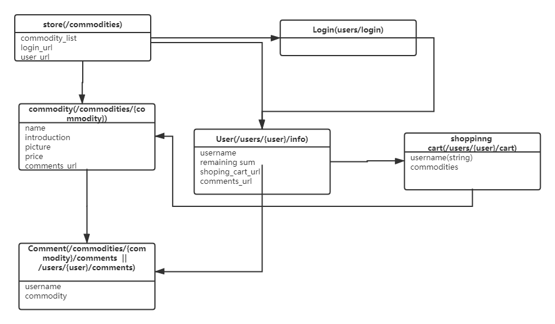

## webapp 后端设计
|  任务   | 人员  |
|  ----  | ----  |
| 后端及测试  | 谢正雄， 周景伟， 周京有 |

## Database Sources

- user
    - username (string)
    - password (string)
    - remaining sum (double)

- commodity
    - name (string)
    - introduction (string)
    - picture (string - picture path )
    - price (double)

- comment
    - username (string)
    - commodity name (string)

- shopping cart
    - username (string)
    - commodity list (list[commodity, commodity, ...])

## 资源模型：

## API
	"/picture"
        -get:  图片
        /picture/upload
        -post: 上传图片到(./picture)
	"/commodities/
         /commodities/{commodityName}
           -get:商品详细信息
         /commodities/{commodityName}/comments
           -get  获取该商品所有评论
           -post （表单：model.Comment) 发布
           -patch （表单：model.Comment) 修改
           -delete （表单：model.Comment) 删除
	"/commodities
        -get  ；所有商品
        -post : 上传商品信息

	/users 
       -get 所有用户
	/users/
        /users/{user}
         -get 用户详细信息
       
	    /users/register 
          -post（model.user) : 注册，使用用户名和密码生成一个token返回给前端
	  

        /users/{user}/cart
	  -在访问该路径时，需要先进行token验证：
          -get 用户的购物车
          -post （model.cart)  更新购物车
             
